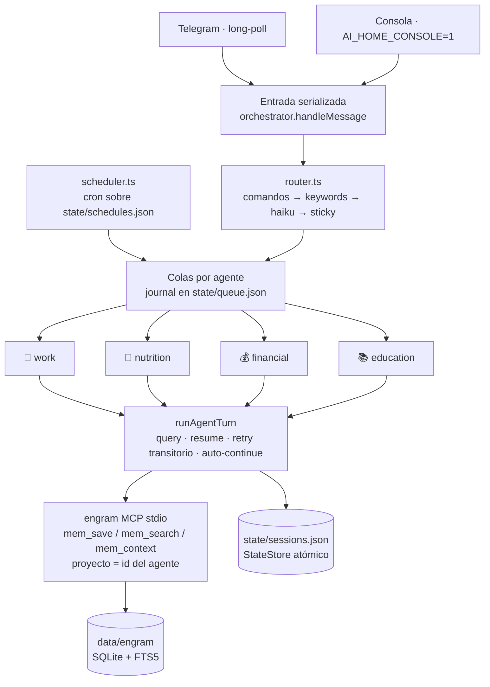

# ai-home

Orquestador multi-agente por Telegram sobre el **Claude Agent SDK**. Un solo bot de
Telegram recibe tus mensajes; el orquestador los enruta al asistente correcto y cada
asistente corre como una sesión resumible de Claude con su propia carpeta, memoria
persistente en **[engram](https://github.com/Gentleman-Programming/engram)** (SQLite +
FTS5 vía MCP) y autonomía total (`bypassPermissions`).



Los agentes corren **en paralelo** (uno activo por agente); la **entrada** se procesa
serializada para que dos mensajes seguidos se ruteen en orden aunque el clasificador
tarde.

## Agentes

| Comando | Agente | Memoria engram (tipos) |
|---|---|---|
| `/work` | 💼 work-assistant | `repo`, `convencion`, `decision` · repos en `work/` |
| `/food` | 🥗 nutrition-assistant | `plan`, `preferencia`, `registro` |
| `/money` | 💰 financial-assistant | `portafolio`, `estrategia`, `chequeo` · análisis en `investments/` |
| `/study` | 📚 education-assistant | `plan`, `certificacion`, `avance` · material en `courses/` |

Meta-comandos: `/status`, `/agents`, `/new <agente>` (nueva sesión, la memoria engram
persiste), `/stop <agente>`, `/help`. El texto libre se enruta por keywords y, si no
alcanza, con un clasificador one-shot (haiku). Di **"usa opus"** dentro de un mensaje
para correr ese turno con otro modelo.

## Memoria (engram)

Cada turno monta un servidor MCP `engram mcp --tools=agent --project <agente>` con
`ENGRAM_DATA_DIR=<data>/engram`: los cuatro agentes comparten el binario y la base,
pero cada uno ve solo su proyecto. Su `CLAUDE.md` (cargado vía
`settingSources: ['project']`) define el protocolo: `mem_context` al empezar,
`mem_save` proactivo con tipos estables, checkpoints de `progreso` en tareas largas y
`mem_session_end` al cerrar.

- **Onboarding**: en la primera sesión de un agente (sin session id guardado) el
  orquestador le inyecta un hint; si su memoria está vacía, entrevista al usuario por
  Telegram y siembra sus memorias. El work-assistant se auto-siembra desde
  `memory/work-assistant/archive/` y los repos ya clonados.
- **Memoria legada**: `setup.sh` archiva los `.md` viejos (BRAIN.md, planes…) en
  `memory/<agente>/archive/` — solo lectura, sin migración automática.
- **Sesión** (`state/sessions.json`): conversación resumible del SDK por agente;
  `/new` la reinicia sin tocar engram.

## Resiliencia

- **Journal de colas** (`state/queue.json`): cada mutación de cola se snapshotea;
  tras un crash o reinicio, `restore()` re-encola lo pendiente y lo que estaba en
  curso (aviso `🔁 Reanudo…`).
- **Apagado ordenado**: SIGTERM/SIGINT aborta los runs, pasa lo en-curso a pendiente
  en el journal y persiste el estado (`TimeoutStopSec=30` en systemd).
- **Errores transitorios** (red, 5xx, timeouts): reintento en el mismo turno con
  backoff 5s/15s/45s (`AI_HOME_TRANSIENT_RETRIES`, default 3).
- **maxTurns agotado**: auto-continúa la misma sesión hasta `AI_HOME_MAX_CONTINUES`
  veces (default 2); los checkpoints `progreso` en engram evitan perder el hilo.
- **Estado atómico**: `sessions.json` y `queue.json` se escriben serializados y con
  tmp+rename; un archivo corrupto se aparta como `.corrupt`, nunca se pisa.

## Proactividad

`state/schedules.json` define jobs cron por agente (hay 3 semilla, deshabilitados).
El scheduler los recarga al detectar cambios — **los propios agentes pueden editarlo**
("recuérdame estudiar L-M-V a las 7pm"). Un JSON inválido no destruye los jobs
cargados: se reintenta y se conserva lo anterior. El resultado de cada job llega por
Telegram.

## Tokens (suscripción Pro)

Pool `default` → `fallback` (`claude setup-token`). Ante límite de uso: cooldown
calculado del mensaje de reset, aviso por Telegram y reintento automático con la otra
cuenta. Con todas agotadas, el turno queda en cola (y en el journal) y se reintenta
al liberarse.

## Instalación

```bash
git clone <este repo> && cd ai-home
sudo AI_HOME_DATA=/ai-home bash deploy/setup.sh   # idempotente
```

`setup.sh` además instala el binario `engram` (pinneado, `ENGRAM_VERSION` para
cambiarlo), siembra plantillas, **sobrescribe siempre** los `CLAUDE.md` de los agentes
(son código, no datos) y archiva la memoria `.md` legada.

Requisitos: Node ≥22 y un usuario de servicio **no root** (claude rechaza
`bypassPermissions` como root) con el claude CLI instalado y `gh` autenticado.
El código vive en el repo; los datos personales en `AI_HOME_DATA` (por defecto
`/ai-home`), fuera de git.

## Variables de entorno (secretos)

Ningún secreto vive en el repo. `setup.sh` crea `/etc/ai-home.env` (root:root, 600)
desde el ejemplo y **se niega a arrancar el servicio hasta que pongas valores reales**:

| Variable | Obligatoria | Cómo obtenerla |
|---|---|---|
| `TELEGRAM_BOT_TOKEN` | sí | Crea un bot con [@BotFather](https://t.me/BotFather) (`/newbot`) |
| `TELEGRAM_CHAT_ID` | sí | Escríbele al bot y consulta `https://api.telegram.org/bot<token>/getUpdates` → `message.chat.id` |
| `CLAUDE_CODE_OAUTH_TOKEN` | sí | `claude setup-token` con tu cuenta Pro/Max (token de ~1 año) |
| `CLAUDE_CODE_OAUTH_TOKEN_FALLBACK` | no | Igual, con una segunda cuenta; rota automáticamente al agotarse el cupo |
| `AI_HOME_DATA` | no | Directorio de datos (por defecto `/ai-home`) |
| `AI_HOME_ENGRAM_BIN` | no | Ruta del binario engram (default: `engram` en el PATH) |
| `AI_HOME_MAX_CONTINUES` | no | Auto-continuaciones al agotar maxTurns (default 2) |
| `AI_HOME_TRANSIENT_RETRIES` | no | Reintentos ante errores transitorios (default 3) |

En producción systemd las inyecta vía `EnvironmentFile=/etc/ai-home.env`. Para
desarrollo local copia `.env.example` a `.env` y usa `npm run dev` (Node las carga
con `--env-file`); `.env` está en `.gitignore`.

## Desarrollo y pruebas

```bash
npm test          # tsc + node:test (state, journal, tokens, router)
AI_HOME_CONSOLE=1 AI_HOME_DATA=/tmp/aihome-dev npm run dev   # sin bot real: stdin/stdout
```

El modo consola usa el mismo orquestador, colas y engram; solo cambia el canal
(interfaz `Messenger`).

## Agregar el agente #5

1. Nueva entrada en `src/agents.ts` (id, emoji, comando, aliases, modelo, descripción).
2. Carpeta `templates/memory/<id>/` con su `CLAUDE.md` (protocolo de memoria engram +
   onboarding; usa los existentes como plantilla).
3. `sudo bash deploy/setup.sh` (siembra la carpeta nueva y reinicia el servicio).

## Operación

```bash
systemctl status ai-home        # estado
journalctl -u ai-home -f        # salida en vivo
cat <data>/state/logs/error.log # solo errores
engram tui                      # explorar la memoria (ENGRAM_DATA_DIR=<data>/engram)
```
